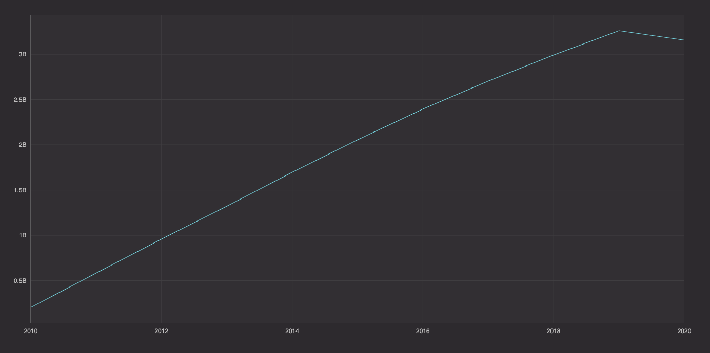
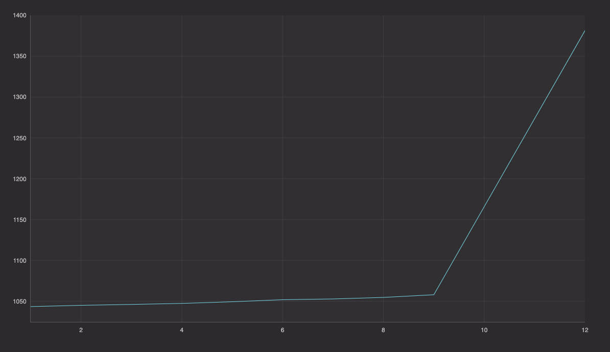

# Processing large CSV data

Recently [Conor O'Sullivan](https://conorosullyds.medium.com/) wrote a great article on [Batch Processing 22GB of Transaction Data with Pandas](https://towardsdatascience.com/batch-processing-22gb-of-transaction-data-with-pandas-c6267e65ff36) that discusses "[h]ow you get around limited computational resources and work with large datasets." His data set is a single CSV file of 22GB, which can be found  on [Kaggle](https://www.kaggle.com/conorsully1/simulated-transactions). You can also find his notebook, [Connor's tutorial](https://github.com/conorosully/medium-articles/blob/master/src/batch_processing.ipynb) and the [Deephaven example](https://github.com/deephaven-examples/processing-large-csv-data) on GitHub.

Using pandas with limited resources, Connor noted aggregations took about 50 minutes each.  

In this example, I'll show you how to take that example and remove pandas, also with limited resources, and use [Deephaven](https://deephaven.io/) to speed things up as much as possible.

With this code, single aggregations take _less than one minute_. With the pandas code, runtime was over 50 minutes. That's an astounding time reduction.

Here are the actual times I got on my normal laptop:

- Read Parquet:  1.0 second.
- Deephaven `sum_by` expense time: 55.9 seconds.
- Deephaven `agg` expense time: 6.1 seconds.
- Deephaven `sum_by` expense time: 152.9 seconds.

Note that the last one is actually several aggregations.

The first issue with datasets this large is loading it to work with in Python. pandas tries to load the entire data set into memory -  this is not possible with limited resources and causes kernal to die.

Deephaven approaches CSV files differently. For more information, see our [blog post on designing our CSV reader](https://deephaven.io/blog/2022/02/23/csv-reader/).

I always think it's important to use the right tool for the job. In this case, the data coms in as a CSV, but actually, a better format is a Parquet file.  I read in the data and wrote each step as a Parquet file.  This means I can come back and read in the Parquet files rather than using CSVs.


## Dependencies

* The [Deephaven-core dependencies](https://github.com/deephaven/deephaven-core#required-dependencies) are required to build and run this project.

## Launch

To launch the latest release, you can clone the repository via:

```shell
git clone https://github.com/deephaven-examples/processing-large-csv-data.git
cd processing-large-csv-data
docker-compose up
```

This code and/or script is meant to work inside the current Deephaven IDE.  Please see our [Quickstart](https://deephaven.io/core/docs/tutorials/quickstart/) if there are any problems or reach out on [Slack](https://join.slack.com/t/deephavencommunity/shared_invite/zt-11x3hiufp-DmOMWDAvXv_pNDUlVkagLQ).


To read in the CSV files took about 50 minutes, even with Deephaven.  Reading in the Parquet file took less than 1 second.

To read in the Parquet file:

```python
from deephaven import parquet
table = parquet.read("/data/transaction_parquet/")
```

If you want to translate the large CSV into smaller Parquet files, use this code. The timing steps show you how long things take:

```python
from deephaven import read_csv
import time

steps = 5000000
count = 0
while True:
    i=count
    start = time.time()
    table = read_csv(file, skip_rows=i*steps, num_rows=steps, allow_missing_columns=True, ignore_excess_columns = True)
    parquet.write(table, f"/data/transaction_parquet/{i}.parquet")
    end = time.time()
    print("read "+str(table.size)+ " in "+ str(end - start) + " seconds." + " iteration number ", i)

    count+=1

    #Exit loop
    if table.size!=steps:
        break
    del(table)
```

- When you run a pandas aggregation, as [Conor O'Sullivan's article notes](https://towardsdatascience.com/batch-processing-22gb-of-transaction-data-with-pandas-c6267e65ff36), it takes about 50 minutes. 
- On my laptop, this was actually closer to 90 minutes. 
- With the Deephaven aggregation, the time was reduced to **less than 30 seconds**.  Deephaven is engineered for large data. 

The time improvement is nice, but I also like that we don't need to do any special batching. It just works with built-in functions.

Here are two different ways to sum up the total expenditures per year. You can see that the results match the original article:

```python
from deephaven.plot.figure import Figure
from deephaven import agg as agg

def dh_agg_expends(table):
    start = time.time()
    data_table = table.agg_by([agg.sum_(cols = ["AMOUNT = AMOUNT"]),\
                            agg.count_(col = "count")], by = ["YEAR"]).sort(order_by = ["YEAR"])
    end = time.time()
    print("Deephaven agg expense time: " + str(end - start) + " seconds.")
    return data_table

def dh_sum_by_expends_monthly(table):
    start = time.time()
    data_table = table.where(["YEAR ==2020", "EXP_TYPE=`Entertainment`"]).agg_by([\
                            agg.sum_(["AMOUNT = AMOUNT"])], by = ["MONTH"]).sort(order_by = ["MONTH"])
    end = time.time()
    print("Deephaven monthly expense time: " + str(end - start) + " seconds.")
    return data_table

deephaven_expense_table_sum = dh_sum_by_expends(table)
deephaven_expense_table_agg = dh_agg_expends(table)

figure = Figure()
plot_expenses_sum=figure.plot_xy(series_name="expense", t=deephaven_expense_table_sum, x="YEAR",y="AMOUNT").show()
plot_expenses_agg=figure.plot_xy(series_name="expense", t=deephaven_expense_table_agg, x="YEAR",y="AMOUNT").show()

```



More advanced operations can be done directly, as shown here: 

```python
def dh_sum_by_monthly(table):
    start = time.time()
    data_table = table.where(["YEAR ==2020", "EXP_TYPE=`Entertainment`"])\
        .agg_by([agg.sum_(cols = ["AMOUNT"])], by = ["CUST_ID","MONTH"])\
        .drop_columns(cols=["CUST_ID"])\
        .avg_by(["MONTH"])\
        .sort(order_by = ["MONTH"])
    end = time.time()
    print("Deephaven sum_by monthly time: " + str(end - start) + " seconds.")
    return data_table

deephaven_sum_by_monthly=dh_sum_by_monthly(table)

plot_dh_sum_by_monthly= figure.plot_xy(series_name="expense", t=deephaven_sum_by_monthly, x="MONTH",y="AMOUNT").show()
```



The code looks more complicated than a typical query because we've wrapped every method in time tests to show the speed of Deephaven. Comment out what operation you want to test to see its performance.

Let us know how your query does on [Slack](https://join.slack.com/t/deephavencommunity/shared_invite/zt-11x3hiufp-DmOMWDAvXv_pNDUlVkagLQ).

There are a lot of options with datasets this large. Time should never be a limiting factor in the data science we can do.
